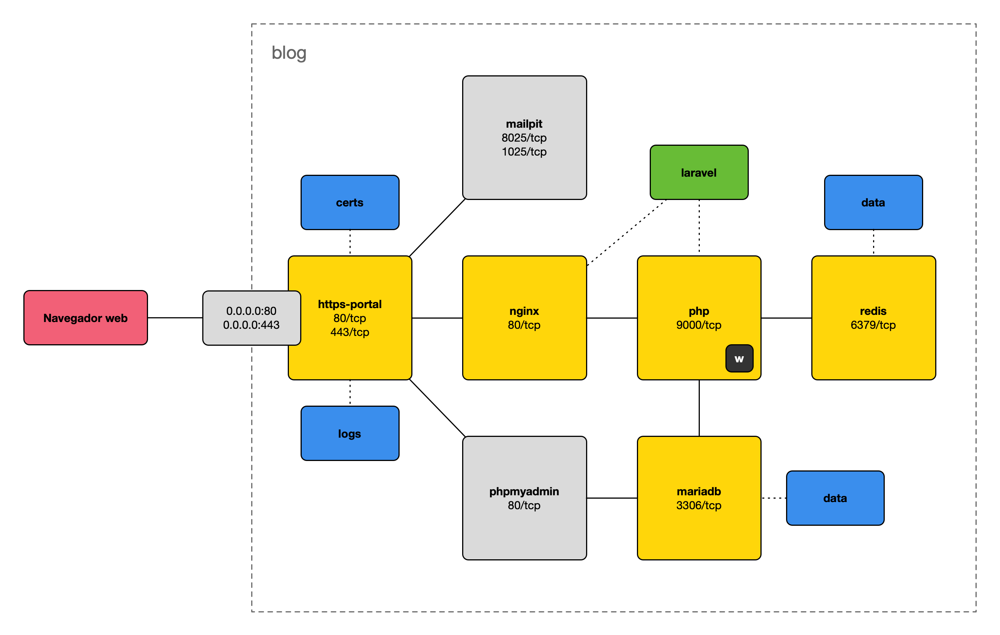

# Blog

Aplicación de ejemplo Laravel.

## Prerrequisitos

1. Instalar [Docker Desktop](https://www.docker.com/products/docker-desktop/).

2. En Windows, instalar [Scoop](https://scoop.sh) usando PowerShell:

   ```powershell
   Set-ExecutionPolicy -ExecutionPolicy RemoteSigned -Scope CurrentUser
   Invoke-RestMethod -Uri https://get.scoop.sh | Invoke-Expression
   ```

   Y después instalar los comandos necesarios:

   ```powershell
   scoop install make
   ```

## Puesta en marcha

1. Clona este repositorio a tu equipo.

2. Crea una entrada para `blog.test`, otra para `phpmyadmin.blog.test` y otra para `mailpit.blog.test` en el fichero
   `/etc/hosts` de tu sistema operativo, apuntando a `127.0.0.1`.

3. Copia el fichero `env-example` del directorio `docker` a `.env` y ajusta las variables si es necesario.

4. Copia el fichero `.env.example` del directorio `laravel` a `.env` y ajusta la configuración de base de datos poniendo
   como nombre de host `mariadb` y el usuario y contraseña configurados en el `.env` del directorio `docker`. Por
   ejemplo:

    ```dotenv
    DB_CONNECTION=mysql
    DB_HOST=mariadb
    DB_PORT=3306
    DB_DATABASE=blog
    DB_USERNAME=blog
    DB_PASSWORD=12345Abcde
    ```

5. Construye las imágenes de los contenedores:

    ```shell
    make build
    ```

6. Arranca los servicios:

    ```shell
    make start
    ```

7. Instala las dependencias de `composer` y `npm`:

    ```shell
    make install
    ```

8. Entra en el contenedor de Laravel con `make workspace`.

9. Crea la clave de aplicación con `php artisan key:generate`. `[Workspace]`

10. Lanza las migraciones de la base de datos con `php artisan migrate`. `[Workspace]`

11. Inserta datos de ejemplo con `php artisan db:seed`. `[Workspace]`

12. Accede a la web en [blog.test](https://blog.test) aceptando el certificado autofirmado.

## Opcional: Tests

1. Accede a [phpmyadmin.blog.test](https://phpmyadmin.blog.test) y crea el usuario `test` con su base de datos asociada.

2. Copia el fichero de configuración `.env` de Laravel a `.env.testing` y actualiza la configuración de base de datos.

3. Lanza los tests:

    ```shell
    make test
    ```

## Estructura de contenedores


